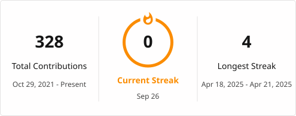

# Duy Nguyen

**Software Developer | Game Development & Reverse Engineering Specialist**

---

## About Me

Specialized in game server development, reverse engineering, and deep learning applications. Focused on building high-performance systems with clean, optimized code architecture.

**Core Expertise:**
- Game server development with high-concurrency optimization 
- Mobile game development and LibGDX framework conversions
- Reverse engineering and binary analysis using IDA Pro
- Deep learning OCR systems and automation tools

---

## Technical Stack

<table width="100%">
<tr>
<td width="25%" align="center">

**Languages**

</td>
<td width="25%" align="center">

**Game Development**

</td>
<td width="25%" align="center">

**Deep Learning**

</td>
<td width="25%" align="center">

**Tools & Infrastructure**

</td>
</tr>
</table>

---

## Featured Projects

<table width="100%">
<tr>
<td width="33%" valign="top">

### AI Function Renamer
**IDA Pro Plugin for Intelligent Function Naming**

AI-powered plugin for automatic function renaming in binary analysis. Features batch processing, parallel execution, and smart duplicate prevention.

`Python` `IDA Pro` `AI` `Reverse Engineering`

</td>
<td width="33%" valign="top">

### DragonBoyOnline J2ME
**Mobile Game Development**

Legacy J2ME mobile game converted to modern LibGDX framework with performance optimizations and cross-platform support.

`Java` `LibGDX` `Game Development`

</td>
<td width="33%" valign="top">

### Dragonboy Captcha OCR
**Deep Learning Captcha Solver**

Advanced OCR system using deep learning models for captcha recognition and solving with high accuracy rates.

`Python` `TensorFlow` `OCR`

</td>
</tr>
<tr>
<td width="33%" valign="top">

### RegisterVMUCourses
**Course Registration Automation System**

Automated registration system using Playwright and Selenium with parallel processing capabilities for Vietnamese Maritime University.

`Java` `Selenium` `Playwright`

</td>
<td width="33%" valign="top">

### NinjaSchool Captcha
**Captcha Generation Engine**

High-performance captcha generation system with customizable difficulty levels and anti-bot capabilities.

`Java` `Image Processing` `Security`

</td>
<td width="33%" valign="top">

### ConvertYoutubeShortToTiktok
**Video Conversion Pipeline**

Automated pipeline for converting YouTube Shorts to TikTok format with optimized encoding and metadata handling.

`Python` `FFmpeg` `Automation`

</td>
</tr>
</table>

---

## GitHub Statistics

 

 

<picture>
  <source media="(prefers-color-scheme: dark)" srcset="https://github.com/duykhongphai/duykhongphai/blob/output/github-contribution-grid-snake-dark.svg">
  <source media="(prefers-color-scheme: light)" srcset="https://github.com/duykhongphai/duykhongphai/blob/output/github-contribution-grid-snake.svg">
  
</picture>

---

